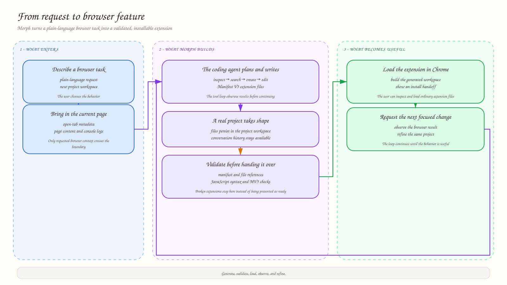

<p align="center">
  
</p>

<h1 align="center">Morph: Your AI Browser Extension Builder</h1>

<p align="center">
  Describe a browser problem in plain language, then build and test a Chrome extension that solves it.
</p>

<!-- README-HACK:NEEDS-OWNER key="demo-video" instruction="Replace with the final public demo video URL when available." -->

## The idea

Browsers are built for the average user, but nobody browses in exactly the same way. Someone may want to hide YouTube Shorts, remove distracting listings, make a page easier to read, or add a workflow that a website never shipped.

Today, solving that problem usually means learning JavaScript and Chrome's extension APIs, finding a trustworthy extension, or giving up. Morph makes the useful middle ground conversational: describe the behavior, inspect the result, and iterate on it without starting from a blank project.

## What Morph does

Morph is a Chrome side-panel experience backed by an AI coding agent. A user describes a browser task and Morph:

1. Creates a project workspace for the request.
2. Writes a Manifest V3 extension, including content scripts and supporting files.
3. Uses browser context when the request depends on the current page or open tabs.
4. Validates the manifest, files, syntax, and extension structure.
5. Builds the extension and presents an install action in the UI.
6. Keeps the conversation available so the user can request a focused change.

The generated result is ordinary Chrome extension code—not a locked-in visual mockup—so it can be inspected, loaded unpacked, and extended later.

<p align="center">
  
</p>

## Examples in the repository

These examples show the kind of practical browser customizations Morph can produce:

| Example | What it demonstrates |
| --- | --- |
| YouTube filter | Hides Shorts and filters videos by title keywords. |
| Email manager | Adds a focused workflow for removing unwanted email. |
| Site-specific ad blocker | Removes unwanted sponsored or advertising elements on selected sites. |

## Why it is useful

Morph is aimed at people who know exactly what they want their browser to do, but do not want to become browser-extension developers first. It is useful for:

- Personal accessibility and reading preferences
- Removing distracting or repetitive page elements
- Small research and productivity workflows
- Site-specific automation that does not justify a full application
- Prototyping an extension before turning it into a maintained product

The important product loop is generate → validate → load → observe → refine. A successful build is not treated as proof that a selector works everywhere, so browser behavior and runtime errors remain part of the workflow.

## How it works

The Chrome extension provides the side-panel chat, project controls, page context, and install handoff. The FastAPI backend maintains projects, conversations, and learned per-project rules while coordinating the coding agent over a bidirectional WebSocket.

The agent can inspect files, search the project semantically, read current tab content, capture console logs, edit files, validate an extension, run terminal commands, and load the finished workspace. The codebase search uses a graph-and-vector index: files are chunked, entities and relationships are extracted, embeddings retrieve relevant chunks, and graph traversal adds nearby context.


The primary agent uses OpenAI's `gpt-5.2`; supporting tasks use `gpt-5-nano-2025-08-07`, and semantic retrieval uses `text-embedding-3-small`. The provider and model configuration live in `backend/utils/config.py`.

## Built with

- React 19, TypeScript, and Vite
- Chrome Manifest V3, Side Panel API, content scripts, and tabs API
- FastAPI, Uvicorn, WebSockets, and Pydantic
- OpenAI models and embeddings through LangChain/OpenAI clients
- SQLite with `aiosqlite`
- NetworkX and NumPy for graph and vector retrieval
- Tailwind CSS and shadcn/ui primitives

## Run locally

### 1. Start the backend

```bash
cd backend
uv sync
export OPENAI_API_KEY="your-key"
uv run main.py
```

The backend listens on port `8001` by default. Set `MORPH_PORT` to change it.

### 2. Build the extension

In a second terminal:

```bash
cd morph-extension
npm install
npm run build
```

Then open `chrome://extensions`, enable Developer mode, choose **Load unpacked**, and select `morph-extension/dist`.

If the backend runs on another URL, set `VITE_API_URL` when building the extension, for example:

```bash
VITE_API_URL=http://localhost:9001 npm run build
```

On macOS, the optional one-click Chrome loading flow also requires Chrome's **Allow JavaScript from Apple Events** setting. Otherwise, load generated extensions manually from `backend/demo_code`.

## What works today

The repository contains the working side panel, project and conversation persistence, streamed agent/tool updates, browser-context requests, semantic codebase search, extension validation, build/install handoff, and regression tests for title generation, memory boundaries, graph retrieval, and closed WebSocket updates.

Generated extensions still depend on the structure and runtime behavior of the websites they target. Users should review requested permissions and test generated behavior before relying on it for important workflows.

## What's next

- Stronger selectors and mutation handling for frequently changing sites
- Accessibility-first templates, including dyslexia-friendly reading modes
- Safer permission explanations and narrower host permissions
- Extension version history and one-click updates
- More model providers, including local and self-hosted options
- A shareable library for discovering and remixing extensions
- Automated regression checks when a target website changes

## Repository

[github.com/vimzh/morph-extension](https://github.com/vimzh/morph-extension)
