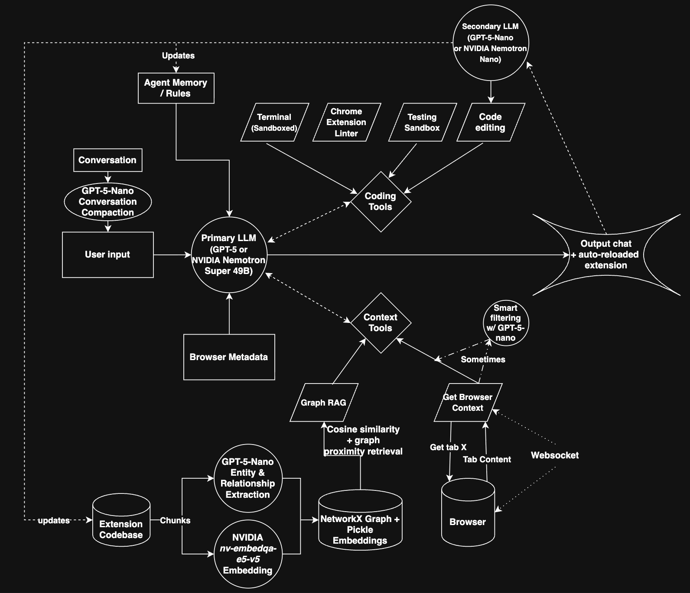

# evolve-browser

## INSTALLATION INSTRUCTIONS (for Chrome extension)

Get backend ready.
1. `cd backend`
2. `uv sync`
3. `uv run main.py`

Get extension ready.
1. `cd evolve-extension`
2. `npm install`
3. `npm run dev`
4. In Chrome, go to `chrome://extensions/`
5. Turn on Developer mode
6. Click `Load Unpacked`
7. Select the `dist` folder inside of `evolve-extension`

NOTE: One-click load for extensions does not work for non-Macs

Mac Instructions:
 - Go to Chrome. Click `View > Developer > Allow JavaScript from Apple Events`

Non-Mac Instructions:
 - Extensions are created inside of `./backend/demo_code`
 - Follow the `Load Unpacked` instructions from above to load in extensions.

## CHROMIUM FORK
The Chromium fork is located in the branch: `chromium`.

## Inspiration
Web browsing is static. Browsers and websites treat all of their users almost exactly the same, but there isn't a one-size fits all for the billions who use the internet. If a user wants some feature added or changed (e.g. hiding all YouTube shorts when visiting the website to avoid distraction), they must either: (i) hope the browser/website developer can and are willing to make it for them, (ii) hope and trust someone made a Chrome extension for their exact use case (without charging an arm and a leg), or (iii) have the time and expertise to make it themself.

We believe we need to stop constraining users with this one-size fits all mindset. As such, we built **evolve(browser)**, a fork of __Chromium__ (and __Chrome Extension__) which makes customizing your browsing experience as easy as sending a single message.

## What it does
**evolve(browser)** pairs an advanced coding agent with complete browser context. This AI agent codes extensions which are loaded directly into the user's browser in real-time. Here are some cool extensions we created for ourselves or that our friends requested using **evolve(browser)** (these all took only 1-2 prompts):

-  Alastair's YouTube filter: When visiting YouTube.com, hide all YouTube shorts and all videos which have any League of Legends keywords in their title between 9 AM - 5 PM.

- Haley's Email Manager: Stanford students get a lot of spam (and are forced to use Outlook), Haley wanted an extension which will help her quickly delete all her spam emails.

- Antonio's Ad Blocker: Chrome banned uBlock Origin (Antonio's favorite ad blocker), but Antonio doesn't want to switch browsers. Antonio uses **evolve** to create a custom ad blocker for his most visited sites (and if he ever wants to extend its ad-blocking capabilities to new sites he can just tell **evolve** to update the extension).

## How we built it

Very high-level agent breakdown:
- A primary large model (GPT-5.2 or NVIDIA Nemotron Super 49B) performs the main reasoning, deciding whether to answer directly or call tools.
- Context tools enhance responses using graph-based RAG over the extension codebase and, when useful, live browser context retrieved via WebSocket.
- The knowledge graph is built offline by chunking the codebase, extracting entities and relationships with GPT-5-Nano, and generating embeddings with NVIDIA’s embedding model.
- When actions are required, coding tools (sandboxed terminal, linter, testing sandbox, and code editor) execute tasks, sometimes assisted by a smaller secondary LLM.
- The primary model synthesizes everything into the final response, which is streamed back to the chat and auto-reloaded browser extension.
- A secondary model extracts rules / memories from the overall conversation for future conversations about this extension.
